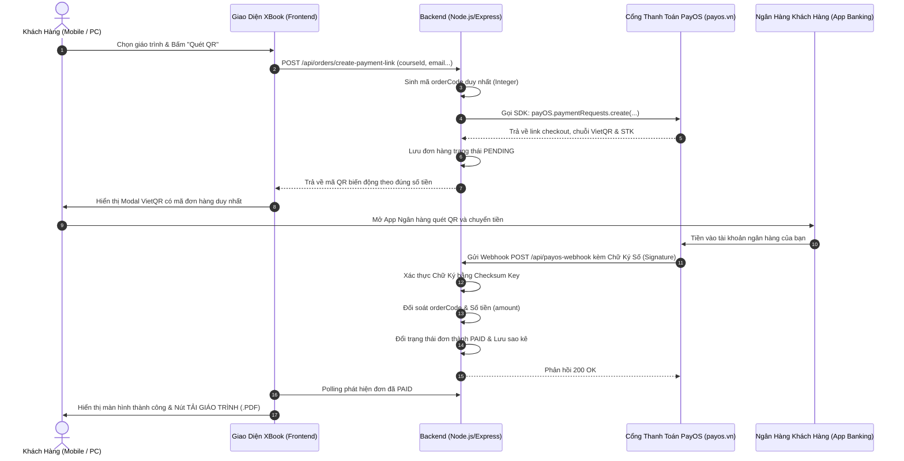

# XBook - Hệ Thống Bán Giáo Trình Tự Động Tích Hợp PayOS (Dynamic VietQR)

Hệ thống mẫu hoàn chỉnh tích hợp cổng thanh toán **PayOS (payos.vn)** sử dụng **Dynamic QR (Mã QR Biến Động)** tự động 100%, không mất phí duy trì, tối ưu giao diện chuẩn Responsive cho cả **Mobile (Điện thoại)** và **Desktop (Máy tính)**.

## ✨ Điểm mới (v1.1.0) — Phân loại Khoa / Lớp / Tên

| Phân loại | Mô tả | Dùng để làm gì |
|---|---|---|
| 🎓 **Theo Khoa** | Mỗi giáo trình gắn 1 khoa (VD: *Khoa CNTT*, *Khoa Kế toán*, *Đại cương*) | Lọc nhanh **list giáo trình cần thiết** theo từng khoa, soạn list báo in |
| 🏫 **Theo Lớp** | Danh sách tên lớp do **người quản trị tự bổ sung** (tab *Quản lý giáo trình*) | Gợi ý lớp khi sinh viên đăng ký, lọc & thống kê đơn theo từng lớp |
| 👤 **Theo Tên** | 1 người mua được **nhiều cuốn khác nhau trong 1 đơn / 1 mã QR** (giỏ hàng) | Gộp toàn bộ đơn trùng tên để phát sách, tránh thất lạc |

- Giao diện mới: lọc theo Khoa (chips) + Lớp (dropdown), giỏ hàng nổi, grid 1→2→3 cột (Mobile→Tablet→Desktop).
- Bảng quản trị 5 tab: **Đơn hàng · Theo tên · Theo lớp · Theo khoa · Quản lý giáo trình** (thêm/sửa/xóa sách, quản lý danh sách khoa & lớp).
- Xuất Excel 4 sheet: *Danh sách phát sách · Tổng hợp theo khoa · Theo tên người mua · Toàn bộ đơn hàng*.
- Xem kế hoạch công việc chi tiết tại [`TASKS.md`](./TASKS.md).

---

## 📸 1. Quy Trình Vận Hành (End-to-End Workflow)



---

## 🛠️ 2. Cấu Trúc Dự Án (File Structure)

```text
xbook/
├── .env.example              # Mẫu cấu hình PayOS keys
├── .env                      # File chứa API Key thật của bạn
├── package.json              # Khai báo thư viện (@payos/node, express, cors, dotenv)
├── database.js               # Module CSDL (Lưu đơn hàng, đối soát sao kê, schema SQL)
├── server.js                 # Backend Express tích hợp PayOS SDK & Webhook
├── public/                   # Giao diện Frontend Responsive Mobile & Desktop
│   ├── index.html            # Trang chủ hiển thị giáo trình, modal QR realtime
│   ├── app.js                # Xử lý logic đặt hàng, polling, đối soát
│   ├── success.html          # Trang thanh toán thành công
│   ├── cancel.html           # Trang báo hủy thanh toán
│   └── mock-checkout.html    # Trang mô phỏng test nội bộ khi chưa có key
└── README.md                 # Hướng dẫn chi tiết
```

---

## ⚙️ 3. Hướng Dẫn Cấu Hình Với PayOS

Dựa theo màn hình bạn đang mở trên PayOS (**Tạo kênh thanh toán > Website > Tên kênh: xbook**):

1. **Bước 1**: Nhập tên kênh: `xbook` và nhấn **Tiếp tục**.
2. **Bước 2**: Chọn tài khoản ngân hàng mà bạn muốn nhận tiền từ khách.
3. **Bước 3**: Nhận bộ 3 khóa kết nối bí mật từ PayOS:
   - `Client ID`
   - `Api Key`
   - `Checksum Key`
4. Mở file `.env` trong thư mục `xbook` và dán các thông tin vào:
   ```env
   PAYOS_CLIENT_ID=f4bffe32-bd9a-11f1-8d57-0242ac110002
   PAYOS_API_KEY=xxxxxxxx-xxxx-xxxx-xxxx-xxxxxxxxxxxx
   PAYOS_CHECKSUM_KEY=xxxxxxxxxxxxxxxxxxxxxxxxxxxxxxxx
   PORT=3000
   BASE_URL=http://localhost:3000
   ```

---

## 🌐 4. Cấu Hình Webhook URL Trên PayOS

PayOS cần gửi Webhook về một địa chỉ công khai (Public URL có HTTPS).
Khi chạy thử nghiệm dưới máy Local (máy tính của bạn):

1. Mở một cửa sổ dòng lệnh và cài đặt/chạy **ngrok** hoặc **localtunnel**:
   ```bash
   npx localtunnel --port 3000
   # hoặc:
   ngrok http 3000
   ```
2. Bạn sẽ nhận được 1 link công khai, ví dụ: `https://xbook-demo.loca.lt`
3. Cập nhật `BASE_URL=https://xbook-demo.loca.lt` trong file `.env`.
4. Vào trang quản trị PayOS > **Kênh thanh toán xbook** > **Cài đặt Webhook** > Điền link:
   ```text
   https://xbook-demo.loca.lt/api/payos-webhook
   ```
5. Bấm **Xác nhận Webhook**. Backend sẽ tự động tiếp nhận và xác thực mã test của PayOS ngay lập tức!

---

## 💻 5. Hướng Dẫn Chạy Dự Án

### Yêu cầu:
- Đã cài đặt **Node.js** (Phiên bản 18+ hoặc 20+) từ trang chủ [nodejs.org](https://nodejs.org/).

### Các bước khởi động:
```bash
# 1. Di chuyển vào thư mục dự án
cd C:\Users\ADMIN\.gemini\antigravity\scratch\xbook

# 2. Cài đặt các gói phụ thuộc
npm install

# 3. Khởi động server
npm start
```

Truy cập trên trình duyệt: `http://localhost:3000`

---

## 🛡️ 6. Giải Thích 2 Hàm Cốt Lõi (PayOS Core Functions)

### A. Hàm tạo link thanh toán Dynamic QR:
- Tạo `orderCode` là số nguyên duy nhất (PayOS quy định `orderCode <= 9007199254740991`).
- Số tiền `amount` được lấy trực tiếp từ giá giáo trình (không thể chỉnh sửa tùy tiện phía client).
- Nội dung chuyển khoản ngắn gọn (`XB${orderCode}`) đảm bảo tối đa 25 ký tự không dấu.

```javascript
const paymentPayload = {
  orderCode: orderCode, // Số nguyên duy nhất
  amount: course.price, // Đúng từng đồng giá giáo trình
  description: `XB${orderCode}`, // Tối đa 25 ký tự
  items: [{ name: course.title, quantity: 1, price: course.price }],
  returnUrl: `${BASE_URL}/success.html?orderCode=${orderCode}`,
  cancelUrl: `${BASE_URL}/cancel.html?orderCode=${orderCode}`
};

// Gọi PayOS SDK
const paymentResponse = await payos.paymentRequests.create(paymentPayload);
```

### B. Hàm xử lý Webhook & Xác thực Chữ ký số (Bảo mật tối đa):
- **Xác thực Chữ Ký (Signature)**: PayOS ký mã hóa SHA256 các trường dữ liệu bằng `CHECKSUM_KEY`. Hàm `payos.webhooks.verify(req.body)` sẽ tính toán lại và so khớp. Nếu kẻ gian giả mạo gói tin HTTP POST gửi vào server của bạn, hàm sẽ bắt lỗi và từ chối 400 Bad Request ngay lập tức!
- **Kiểm tra Đối soát**: So sánh `order.amount === verifiedData.amount` để tránh trường hợp thanh toán thiếu tiền.
- **Tính Bất Biến (Idempotency)**: Nếu đơn hàng đã `PAID` từ trước, bỏ qua không kích hoạt hoặc gửi trùng tài liệu, phản hồi 200 OK ngay.

```javascript
app.post('/api/payos-webhook', (req, res) => {
  // 1. Xác thực chữ ký số bằng SDK
  const verifiedData = payos.webhooks.verify(req.body);

  // 2. Đối soát đơn hàng & số tiền trong Database
  const order = db.getOrderByCode(verifiedData.orderCode);
  if (!order || order.amount !== verifiedData.amount) {
    return res.status(400).send("Dữ liệu không hợp lệ");
  }

  // 3. Tránh kích hoạt trùng lặp
  if (order.status === 'PAID') {
    return res.status(200).send("Đã xử lý trước đó");
  }

  // 4. Cập nhật trạng thái & Kích hoạt dịch vụ cho khách
  db.updateOrderStatus(order.orderCode, 'PAID', {
    reference: verifiedData.reference,
    paidAt: verifiedData.transactionDateTime
  });

  return res.status(200).send("Thành công");
});
```

---

## 🗄️ 7. Cấu Trúc Database & Chiến Lược Đối Soát Đơn Hàng

Để một hệ thống bán dịch vụ tự động hoạt động ổn định và kế toán kiểm soát minh bạch, bạn cần lưu trữ 4 bảng dữ liệu:

1. **`courses` (Danh mục Giáo trình/Dịch vụ)**: Lưu ID, tên, mức giá, link tải bản PDF đầy đủ, mã kích hoạt.
2. **`orders` (Đơn hàng)**: Lưu `order_code` (mã số nguyên duy nhất khớp với PayOS), thông tin khách (tên, email), trạng thái (`PENDING` -> `PAID`), thời gian tạo.
3. **`payment_transactions` (Lịch sử giao dịch sao kê)**: Lưu các thông tin tài chính do PayOS trả về: `reference` (mã giao dịch ngân hàng FT...), số tài khoản người gửi, tên ngân hàng người gửi, số tiền thực nhận.
4. **`webhook_logs` (Nhật ký tín hiệu Webhook)**: Lưu vết toàn bộ raw payload và trạng thái chữ ký số (`is_verified`) phục vụ kiểm toán hoặc tra soát khi có khiếu nại.
