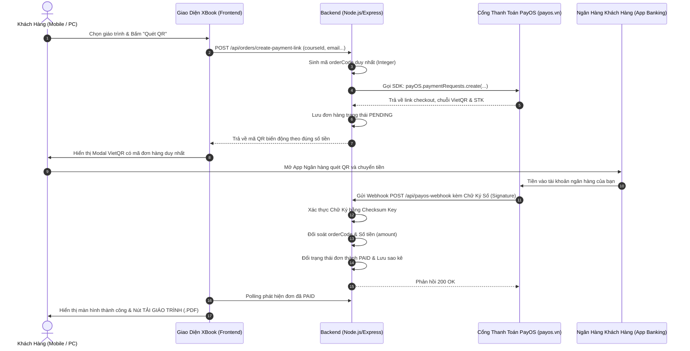

# XBook - Hệ Thống Bán Giáo Trình Tự Động Tích Hợp PayOS (Dynamic VietQR)

Hệ thống mẫu hoàn chỉnh tích hợp cổng thanh toán **PayOS (payos.vn)** sử dụng **Dynamic QR (Mã QR Biến Động)** tự động 100%, không mất phí duy trì, tối ưu giao diện chuẩn Responsive cho cả **Mobile (Điện thoại)** và **Desktop (Máy tính)**.

## ✨ Điểm mới (v1.3.2) — Lọc theo ngày & Quyết toán từng ngày

| Tính năng | Mô tả |
|---|---|
| 📅 **Lọc theo ngày** | Bảng Quản Lý → tab *Đơn hàng*: chips **Tất cả · Hôm nay · Hôm qua · 7 ngày · 30 ngày** + ô **Từ ngày → Đến ngày** để chọn khoảng bất kỳ |
| 🔀 **2 cách tính ngày** | Chọn lọc theo **Ngày đặt hàng** (`createdAt`) hoặc **Ngày thanh toán** (`paidAt`) — đúng nhu cầu đối soát tiền về |
| 🧮 **Bảng “Quyết toán theo từng ngày”** | Liệt kê từng ngày: số **đơn đã nộp · số cuốn · doanh thu** + dòng TỔNG CỘNG. **Bấm vào một dòng để lọc đúng ngày đó** (bấm lại để bỏ lọc) |
| 🔄 **Lọc áp dụng toàn bảng** | Số lượng từng cuốn cần in, danh sách phát sách, tab *Theo tên · Theo lớp · Theo khoa*, tổng tiền và số đơn đều tính theo khoảng ngày đang chọn |
| 📊 **Excel theo ngày** | File xuất bám đúng khoảng đang lọc (tiêu đề ghi rõ khoảng ngày), thêm **sheet “Quyết Toán Theo Ngày”** (ngày, thứ, đơn, cuốn, doanh thu, trung bình/đơn) và cột **Ngày Đặt** ở sheet phát sách & toàn bộ đơn hàng. Tên file: `XBook_QuyetToan_..._20261007.xlsx` |
| 🖨️ **In theo ngày** | Bảng đang lọc in ra đúng danh sách của ngày đó (khối lọc tự ẩn khi in) |

## ✨ Điểm cũ (v1.3.1) — Chọn lớp đồng bộ giao diện + Bắt buộc Tên / SĐT / Lớp

| Tính năng | Mô tả |
|---|---|
| 🎛️ **Dropdown chọn lớp tự vẽ** | Không còn dùng list mặc định của trình duyệt (`<select>`): mọi ô chọn **khoa / lớp** (trang chủ, form mua sách, bộ lọc quản trị, thiết lập sách theo lớp) đều là dropdown bo tròn theo theme xbook — chia nhóm theo khoa, có ô *tìm nhanh* không phân biệt dấu, điều khiển được bằng bàn phím |
| ✅ **Bắt buộc Họ tên** | Tối thiểu 2 từ (Họ + Tên) để tìm tên khi phát sách trên lớp |
| ✅ **Bắt buộc Số điện thoại** | Phải đúng 10 số dạng `0xxxxxxxxx` (tự chuẩn hóa `+84`, khoảng trắng, dấu chấm); lưu dạng chuẩn để liên hệ khi phát sách |
| ✅ **Bắt buộc Lớp học** | Phải chọn lớp trong danh sách khoa/lớp do quản trị khai báo. Chưa mở lớp nào → nút đặt mua bị khóa kèm hướng dẫn liên hệ quản trị viên |
| 🛡️ **Chặn ở cả 2 phía** | Form hiện lỗi ngay dưới từng ô (không dùng popup), server trả **400** kèm thông báo tiếng Việt nếu thiếu/sai — không thể lách bằng cách gọi API trực tiếp |

## ✨ Điểm cũ (v1.3.0) — Sách gắn Khoa/Lớp + Ghi nhớ đăng nhập + PWA iPhone

| Tính năng | Mô tả |
|---|---|
| 📚 **Sách KHÔNG thuộc khoa nào** | Toàn bộ sách nằm trong **danh mục chung**. Khi quản trị *add sách vào khoa/lớp* thì cuốn đó trở thành **sách cần có khi học (các) lớp ấy** — VD *Khoa Kinh tế* cũng học *Triết*, học *Vật lí* như bình thường |
| 🧩 **Tích chọn khoa/lớp ngay trong form sách** | Form *Thêm / Sửa sách* có khối **“Sách này cần học ở khoa / lớp nào?”**: tích cả **khoa** (áp dụng cho mọi lớp của khoa) hoặc mở rộng chọn **từng lớp**. Bỏ tích = sách trở lại danh mục chung |
| 🔎 **Lọc thư viện sách** | Tab *Quản lý sách* có bộ lọc **Mọi khoa / Mọi lớp / tìm tên sách – tác giả** và hiển thị số lớp đang dùng mỗi cuốn |
| 🔐 **Ghi nhớ đăng nhập** | Tích **“Ghi nhớ đăng nhập (30 ngày)”** khi đăng nhập → mở lại web **không cần nhập lại mật khẩu**. Bỏ tích nếu dùng máy chung (chỉ nhớ trong phiên). Token phiên có chữ ký HMAC, không lưu mật khẩu, đổi mật khẩu là mọi token cũ hết hiệu lực |
| 📱 **PWA cho iPhone** | *Thêm vào Màn hình chính* trên Safari → xbook chạy **toàn màn hình như app**, có icon riêng, có manifest + service worker; trang tĩnh mở được khi mạng chập chờn, dữ liệu đơn hàng luôn lấy mới từ server |
| 🧪 **Kiểm thử mở rộng** | `npm test`: 9 bài test (token phiên, gán sách theo khoa/lớp, bộ lọc thư viện, PWA, luồng API & giao diện) |

## ✨ Điểm cũ (v1.2.0) — Chỉ còn Khoa CNTT + Quản lý sách + Chốt sổ theo ngày nhận sách

| Tính năng | Mô tả |
|---|---|
| 🎓 **Chỉ còn Khoa CNTT** | Bỏ 2 khoa "Đại cương" và "Kế toán" — toàn bộ danh mục chỉ phân loại theo **Khoa CNTT** |
| 📚 **Quản lý sách** | Tab *Quản lý sách* trong Bảng Quản Lý: thêm / sửa / xóa đầy đủ **tên sách, ảnh bìa (dán link HOẶC upload từ máy), giá tiền, tác giả/NXB, số trang, năm/bản in, mô tả, khoa, lớp** — bảng sách có thumbnail ảnh bìa |
| 🔒 **Chốt sổ + Ngày nhận sách** | Admin chọn **ngày nhận sách** (VD: mở lại nhận đơn 07/10 → hệ thống tự đặt nhận sách **08/10**, chỉnh được bất cứ lúc nào) + **lưu ý thời gian** ngắn gọn (mặc định: *"Sách thường giao ngay hôm sau nếu có tiết."*). Sinh viên thấy ngay trên banner trang chủ, trong form đăng ký và màn hình thanh toán thành công |
| 💡 **Ngắn gọn hơn** | Banner trạng thái & các nhãn UI được làm gọn, thống nhất gọi là "sách" |

## ✨ Điểm cũ (v1.1.0) — Phân loại Khoa / Lớp / Tên

| Phân loại | Mô tả | Dùng để làm gì |
|---|---|---|
| 🎓 **Theo Khoa** | Mỗi giáo trình gắn 1 khoa (VD: *Khoa CNTT*, *Khoa Kế toán*, *Đại cương*) | Lọc nhanh **list giáo trình cần thiết** theo từng khoa, soạn list báo in |
| 🏫 **Theo Lớp** | Danh sách tên lớp do **người quản trị tự bổ sung** (tab *Quản lý giáo trình*) | Gợi ý lớp khi sinh viên đăng ký, lọc & thống kê đơn theo từng lớp |
| 👤 **Theo Tên** | 1 người mua được **nhiều cuốn khác nhau trong 1 đơn / 1 mã QR** (giỏ hàng) | Gộp toàn bộ đơn trùng tên để phát sách, tránh thất lạc |

- Giao diện mới: lọc theo Khoa (chips) + Lớp (dropdown), giỏ hàng nổi, grid 1→2→3 cột (Mobile→Tablet→Desktop).
- Bảng quản trị 5 tab: **Đơn hàng · Theo tên · Theo lớp · Theo khoa · Quản lý giáo trình** (thêm/sửa/xóa sách, quản lý danh sách khoa & lớp).
- Xuất Excel 4 sheet: *Danh sách phát sách · Tổng hợp theo khoa · Theo tên người mua · Toàn bộ đơn hàng*.
- Xem kế hoạch công việc chi tiết tại [`TASKS.md`](./TASKS.md).

---

## 📸 1. Quy Trình Vận Hành (End-to-End Workflow)



---

## 🛠️ 2. Cấu Trúc Dự Án (File Structure)

```text
xbook/
├── .env.example              # Mẫu cấu hình PayOS keys
├── .env                      # File chứa API Key thật của bạn
├── package.json              # Khai báo thư viện (@payos/node, express, cors, dotenv)
├── database.js               # Module CSDL (Lưu đơn hàng, đối soát sao kê, schema SQL)
├── server.js                 # Backend Express: PayOS SDK, Webhook, phiên quản trị, manifest + service worker
├── public/                   # Giao diện Frontend Responsive Mobile & Desktop
│   ├── index.html            # Trang chủ hiển thị giáo trình, modal QR realtime
│   ├── app.js                # Xử lý logic đặt hàng, polling, đối soát, phiên quản trị, gán sách theo khoa/lớp
│   ├── domain.js             # Logic dùng chung: lớp, bộ lọc, lịch giao, phạm vi khoa/lớp của sách
│   ├── manifest.webmanifest  # Khai báo PWA (icon, màu, chế độ toàn màn hình)
│   ├── sw.js                 # Service worker: cache trang tĩnh, không cache API
│   ├── icons/                # Icon PWA 192 / 512 / maskable 512
│   ├── success.html          # Trang thanh toán thành công
│   ├── cancel.html           # Trang báo hủy thanh toán
│   └── mock-checkout.html    # Trang mô phỏng test nội bộ khi chưa có key
└── README.md                 # Hướng dẫn chi tiết
```

---

## ⚙️ 3. Hướng Dẫn Cấu Hình Với PayOS

Dựa theo màn hình bạn đang mở trên PayOS (**Tạo kênh thanh toán > Website > Tên kênh: xbook**):

1. **Bước 1**: Nhập tên kênh: `xbook` và nhấn **Tiếp tục**.
2. **Bước 2**: Chọn tài khoản ngân hàng mà bạn muốn nhận tiền từ khách.
3. **Bước 3**: Nhận bộ 3 khóa kết nối bí mật từ PayOS:
   - `Client ID`
   - `Api Key`
   - `Checksum Key`
4. Mở file `.env` trong thư mục `xbook` và dán các thông tin vào:
   ```env
   PAYOS_CLIENT_ID=f4bffe32-bd9a-11f1-8d57-0242ac110002
   PAYOS_API_KEY=xxxxxxxx-xxxx-xxxx-xxxx-xxxxxxxxxxxx
   PAYOS_CHECKSUM_KEY=xxxxxxxxxxxxxxxxxxxxxxxxxxxxxxxx
   PORT=3000
   BASE_URL=http://localhost:3000
   ```

---

## 🌐 4. Cấu Hình Webhook URL Trên PayOS

PayOS cần gửi Webhook về một địa chỉ công khai (Public URL có HTTPS).
Khi chạy thử nghiệm dưới máy Local (máy tính của bạn):

1. Mở một cửa sổ dòng lệnh và cài đặt/chạy **ngrok** hoặc **localtunnel**:
   ```bash
   npx localtunnel --port 3000
   # hoặc:
   ngrok http 3000
   ```
2. Bạn sẽ nhận được 1 link công khai, ví dụ: `https://xbook-demo.loca.lt`
3. Cập nhật `BASE_URL=https://xbook-demo.loca.lt` trong file `.env`.
4. Vào trang quản trị PayOS > **Kênh thanh toán xbook** > **Cài đặt Webhook** > Điền link:
   ```text
   https://xbook-demo.loca.lt/api/payos-webhook
   ```
5. Bấm **Xác nhận Webhook**. Backend sẽ tự động tiếp nhận và xác thực mã test của PayOS ngay lập tức!

---

## 💻 5. Hướng Dẫn Chạy Dự Án

### Yêu cầu:
- Đã cài đặt **Node.js** (Phiên bản 18+ hoặc 20+) từ trang chủ [nodejs.org](https://nodejs.org/).

### Các bước khởi động:
```bash
# 1. Di chuyển vào thư mục dự án
cd C:\Users\ADMIN\.gemini\antigravity\scratch\xbook

# 2. Cài đặt các gói phụ thuộc
npm install

# 3. Khởi động server
npm start
```

Truy cập trên trình duyệt: `http://localhost:3000`

---

## 🛡️ 6. Giải Thích 2 Hàm Cốt Lõi (PayOS Core Functions)

### A. Hàm tạo link thanh toán Dynamic QR:
- Tạo `orderCode` là số nguyên duy nhất (PayOS quy định `orderCode <= 9007199254740991`).
- Số tiền `amount` được lấy trực tiếp từ giá giáo trình (không thể chỉnh sửa tùy tiện phía client).
- Nội dung chuyển khoản ngắn gọn (`XB${orderCode}`) đảm bảo tối đa 25 ký tự không dấu.

```javascript
const paymentPayload = {
  orderCode: orderCode, // Số nguyên duy nhất
  amount: course.price, // Đúng từng đồng giá giáo trình
  description: `XB${orderCode}`, // Tối đa 25 ký tự
  items: [{ name: course.title, quantity: 1, price: course.price }],
  returnUrl: `${BASE_URL}/success.html?orderCode=${orderCode}`,
  cancelUrl: `${BASE_URL}/cancel.html?orderCode=${orderCode}`
};

// Gọi PayOS SDK
const paymentResponse = await payos.paymentRequests.create(paymentPayload);
```

### B. Hàm xử lý Webhook & Xác thực Chữ ký số (Bảo mật tối đa):
- **Xác thực Chữ Ký (Signature)**: PayOS ký mã hóa SHA256 các trường dữ liệu bằng `CHECKSUM_KEY`. Hàm `payos.webhooks.verify(req.body)` sẽ tính toán lại và so khớp. Nếu kẻ gian giả mạo gói tin HTTP POST gửi vào server của bạn, hàm sẽ bắt lỗi và từ chối 400 Bad Request ngay lập tức!
- **Kiểm tra Đối soát**: So sánh `order.amount === verifiedData.amount` để tránh trường hợp thanh toán thiếu tiền.
- **Tính Bất Biến (Idempotency)**: Nếu đơn hàng đã `PAID` từ trước, bỏ qua không kích hoạt hoặc gửi trùng tài liệu, phản hồi 200 OK ngay.

```javascript
app.post('/api/payos-webhook', (req, res) => {
  // 1. Xác thực chữ ký số bằng SDK
  const verifiedData = payos.webhooks.verify(req.body);

  // 2. Đối soát đơn hàng & số tiền trong Database
  const order = db.getOrderByCode(verifiedData.orderCode);
  if (!order || order.amount !== verifiedData.amount) {
    return res.status(400).send("Dữ liệu không hợp lệ");
  }

  // 3. Tránh kích hoạt trùng lặp
  if (order.status === 'PAID') {
    return res.status(200).send("Đã xử lý trước đó");
  }

  // 4. Cập nhật trạng thái & Kích hoạt dịch vụ cho khách
  db.updateOrderStatus(order.orderCode, 'PAID', {
    reference: verifiedData.reference,
    paidAt: verifiedData.transactionDateTime
  });

  return res.status(200).send("Thành công");
});
```

---

## 🗄️ 7. Cấu Trúc Database & Chiến Lược Đối Soát Đơn Hàng

Để một hệ thống bán dịch vụ tự động hoạt động ổn định và kế toán kiểm soát minh bạch, bạn cần lưu trữ 4 bảng dữ liệu:

1. **`courses` (Danh mục Giáo trình/Dịch vụ)**: Lưu ID, tên, mức giá, link tải bản PDF đầy đủ, mã kích hoạt.
2. **`orders` (Đơn hàng)**: Lưu `order_code` (mã số nguyên duy nhất khớp với PayOS), thông tin khách (tên, email), trạng thái (`PENDING` -> `PAID`), thời gian tạo.
3. **`payment_transactions` (Lịch sử giao dịch sao kê)**: Lưu các thông tin tài chính do PayOS trả về: `reference` (mã giao dịch ngân hàng FT...), số tài khoản người gửi, tên ngân hàng người gửi, số tiền thực nhận.
4. **`webhook_logs` (Nhật ký tín hiệu Webhook)**: Lưu vết toàn bộ raw payload và trạng thái chữ ký số (`is_verified`) phục vụ kiểm toán hoặc tra soát khi có khiếu nại.

### Lịch giao và danh mục khoa/lớp

- Sách là danh mục chung, không thuộc khoa. Quản trị thêm/sửa sách độc lập.
- Quản trị → Danh sách lớp: chọn khoa và nhập tên lớp. Trong “Sách cần học theo lớp”, chọn lớp, đánh dấu các sách cần học rồi lưu. Một cuốn dùng được ở nhiều lớp, nhiều khoa.
- `settings.classes` có cấu trúc `{ name, department, bookIds }`. Bộ lọc khoa lấy hợp danh sách sách của các lớp trong khoa (không trùng); bộ lọc lớp lấy đúng `bookIds` của lớp. Khoa/lớp chỉ giúp tìm sách, không hạn chế mua sách trong danh mục chung.
- Tên lớp trùng giữa các khoa được phân biệt bằng cặp khoa/tên lớp. Đơn mới lưu `customerDepartment` khi khách chọn lớp.
- Quan hệ khoa/lớp trên sách cũ được chuyển một lần sang danh sách sách của lớp (`catalogVersion: 2`). Neon giữ cột cũ để không phá dữ liệu nhưng không dùng chúng cho sách mới/bộ lọc. Không tự gán lớp khi danh sách lớp trống.
- Mỗi đơn mới lưu `deliveryAt`: muộn hơn giữa thời điểm đặt + 24 giờ và 00:00 ngày giao chung (UTC+7). Lịch đơn đã tạo không đổi khi sửa cài đặt. Đơn cũ không tự suy đoán lịch giao.
- Kiểm thử: `npm test` (unit, API với dữ liệu tạm/PayOS demo và giao diện qua jsdom; không gọi thanh toán thật).

---

## 📱 8. Cài XBook như App trên iPhone & Android (PWA)

XBook đã có **Web App Manifest** (`/manifest.webmanifest`) + **Service Worker** (`/sw.js`) nên cài được lên màn hình chính, mở toàn màn hình (không còn thanh địa chỉ) và có icon riêng.

### Trên iPhone / iPad (bắt buộc dùng **Safari**)
1. Mở `https://xbook1.vercel.app` bằng **Safari**.
2. Bấm nút **Chia sẻ** (ô vuông có mũi tên chỉ lên) ở thanh dưới.
3. Chọn **Thêm vào Màn hình chính** → **Thêm**.
4. Mở icon **xbook** vừa tạo → web chạy toàn màn hình như app thật.

> Trang chủ tự hiện **gợi ý cài đặt** khi phát hiện bạn đang dùng Safari trên iPhone (bấm ✕ để tắt vĩnh viễn).

### Trên Android (Chrome / Edge / Cốc Cốc)
- Bấm biểu tượng **Cài đặt / Thêm vào Màn hình chính** ở thanh địa chỉ, hoặc menu ⋮ → *Thêm vào Màn hình chính*.

### Lưu ý kỹ thuật
- PWA yêu cầu **HTTPS** (Vercel đã có sẵn). Chạy `localhost` vẫn cài được để thử.
- Service worker **chỉ cache file tĩnh** (HTML, JS, logo, icon). Mọi request `/api/...` luôn đi thẳng lên server → số lượng sách, trạng thái đăng ký, đơn hàng **không bao giờ bị cũ**.
- Mở app khi mất mạng: các trang tĩnh vẫn hiển thị; thao tác cần dữ liệu (đặt sách, chốt sổ) sẽ báo lỗi kết nối cho tới khi có mạng.
- **Khi deploy bản mới**: tăng `CACHE_NAME` trong `public/sw.js` (`xbook-static-v3` → `v4`) để mọi máy xoá cache tĩnh cũ và nhận giao diện mới.

---

## 🔐 9. Phiên Đăng Nhập Quản Trị (không cần nhập lại mật khẩu)

- Khi đăng nhập, server cấp **token phiên** ký HMAC-SHA256 (mặc định **30 ngày**); client lưu token này và gửi qua header `x-admin-token` cho mọi API quản trị.
- Tích **“Ghi nhớ đăng nhập”** → lưu token vào `localStorage` (mở lại web, tắt máy vẫn còn phiên). Bỏ tích → chỉ lưu `sessionStorage` (đóng trình duyệt là hết).
- **Không lưu mật khẩu** ở bất kỳ đâu; token là chuỗi có hạn dùng và chữ ký, không thể sửa nội dung.
- Đổi `ADMIN_PASSWORD` (hoặc `ADMIN_SESSION_SECRET`) → **toàn bộ token cũ hết hiệu lực** ngay lập tức.
- Tùy biến trong `.env`:
  ```env
  ADMIN_SESSION_DAYS=30            # số ngày ghi nhớ phiên (mặc định 30)
  ADMIN_SESSION_SECRET=...         # khóa ký riêng (tùy chọn; mặc định = ADMIN_PASSWORD)
  ```
- Bấm **“Khóa lại”** trong Bảng Quản Lý để đăng xuất và xóa token khỏi thiết bị.

---

## 🧩 10. Gán Sách Vào Khoa / Lớp (curriculum của lớp)

- **Sách không thuộc khoa nào**: mọi cuốn nằm trong *danh mục chung*, thêm/sửa/xóa độc lập.
- Trong form sách, khối **“Sách này cần học ở khoa / lớp nào?”**:
  - Tích **cả khoa** → mọi lớp của khoa đó đều cần cuốn này (VD *Khoa Kinh tế* cũng học *Triết*).
  - Hoặc mở *“chọn từng lớp cụ thể”* → chỉ định đích danh lớp cần học.
  - Bỏ tích hết → sách trở lại danh mục chung (sinh viên vẫn thấy ở mục **Tất cả** và vẫn mua được).
- Có thể gán nhanh ở khối *“Sách cần học theo lớp”* (panel bên phải tab Quản lý sách) với cách chọn lớp → tích sách.
- Trang chủ: sinh viên chọn **Khoa → Lớp** để xem danh sách sách cần học của mình; bộ lọc chỉ để **gợi ý**, không chặn mua.
- API tương ứng: `POST /api/admin/books`, `PUT /api/admin/books/:id` nhận thêm `departments: []` (tên khoa) và `classKeys: []` (khóa `["Khoa","Lớp"]`); phản hồi kèm `settings` mới.

---

## 🎛️ 11. Ô Chọn Khoa / Lớp (dropdown tự vẽ)

- Toàn bộ ô chọn **khoa / lớp** dùng component `XBookSelect` trong `public/app.js`; **không** còn `<select>` hay `<datalist>` mặc định của trình duyệt (đã có test `document.querySelectorAll('select').length === 0`).
- Áp dụng ở: bộ lọc lớp trang chủ, **form đăng ký mua sách**, lọc lớp trong tab *Đơn hàng*, bộ lọc thư viện sách (khoa + lớp), *Sách cần học theo lớp*, ô chọn khoa khi thêm lớp.
- Đặc điểm: panel bo tròn theo theme xbook, **chia nhóm theo khoa**, ô *tìm nhanh* (bỏ dấu tiếng Việt — gõ `kinh te` vẫn ra `Kinh tế`) khi có hơn 7 lựa chọn, điều hướng bàn phím `Enter` / `Space` / `↑` / `↓` / `Esc`, bấm ra ngoài tự đóng.
- Giá trị truyền đi vẫn là khóa chuẩn `["Khoa","Lớp"]` nên đồng bộ với bộ lọc, thống kê và Excel.

## ✅ 12. Điều Kiện Bắt Buộc Khi Mua Sách

| Trường | Bắt buộc | Quy tắc |
|---|---|---|
| **Họ và tên** | ✅ | Tối thiểu 2 từ (Họ + Tên), tối đa theo độ dài ô nhập |
| **Số điện thoại** | ✅ | 10 số dạng `0xxxxxxxxx`; chấp nhận `+84 987 654 321`, `0987.654.321`, `0987-654-321` và tự chuẩn hóa |
| **Lớp học** | ✅ | Phải chọn từ danh sách khoa/lớp do quản trị khai báo |

- Form hiển thị lỗi ngay dưới ô nhập (`formCustomerNameError`, `formCustomerPhoneError`, `formCustomerClassError`).
- Server (`POST /api/orders/create-payment-link`) kiểm tra lại toàn bộ và trả **400** nếu thiếu/sai — API không thể bị lách từ bên ngoài.
- ⚠️ **Lưu ý vận hành**: vì lớp là bắt buộc, quản trị viên cần khai báo **Khoa → Lớp** (tab *Quản lý sách*) trước khi mở nhận đơn; nếu chưa có lớp nào, sinh viên sẽ thấy thông báo yêu cầu liên hệ quản trị viên và nút đặt mua tạm khóa.

---

## 📅 13. Lọc Theo Ngày & Quyết Toán Từng Ngày

### Cách dùng
1. Mở **Bảng Quản Lý** → tab **Đơn hàng** → khối **“Lọc theo ngày”** ở trên cùng.
2. Chọn nhanh: **Hôm nay / Hôm qua / 7 ngày / 30 ngày**, hoặc nhập **Từ ngày → Đến ngày** (nhập ngược sẽ tự đảo).
3. Chọn mốc thời gian: **Ngày đặt hàng** (khách bấm mua) hay **Ngày thanh toán** (tiền về tài khoản).
4. Xem bảng **“Quyết toán theo từng ngày”** — bấm một dòng để lọc đúng ngày đó (tiện chốt sổ cuối ngày).
5. Bấm **Xuất Excel** để lấy file quyết toán của khoảng đang lọc.

### Chi tiết kỹ thuật
- Hàm thuần trong `public/app.js`: `localDateKey`, `orderFilterDateKey`, `filterOrdersByAdminDate`, `groupOrdersByDay`, `computeBookSummary`, `adminDateFilterState`.
- Ngày được tính theo **giờ địa phương của máy** (`YYYY-MM-DD`), không lệch múi giờ khi đối soát.
- Bộ lọc chạy **hoàn toàn ở client** trên dữ liệu `/api/admin/statistics` (không đổi API, không ảnh hưởng dữ liệu gốc).
- Đơn **PENDING** không được tính vào doanh thu/quyết toán (chỉ tính đơn `PAID`); khi lọc theo *Ngày thanh toán*, đơn chưa trả tiền bị loại khỏi mọi danh sách.
- Test tự động: `test/frontend.test.js` kiểm tra đủ 4 trường hợp (ngày đặt, ngày thanh toán, khoảng tùy chọn, khoảng rỗng) + bấm dòng để lọc/bỏ lọc.
